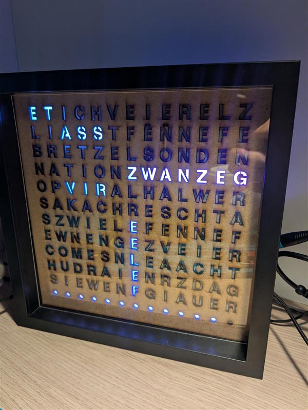

# Luxembourgish Word Clock

A customizable RGB LED word clock that displays time in Luxembourgish, with special animations for holidays and events.

## Overview

This project creates a beautiful word clock using an addressable RGB LED strip arranged in a 13x12 matrix. The clock displays the current time in Luxembourgish phrases (e.g., "ET ASS HALWER ZWIELEF" for "It is half past eleven"), with smooth color transitions and special animations for holidays and events in Luxembourg.

## Features

- Displays time in Luxembourgish phrases
- Dynamic RGB color patterns that smoothly transition
- Automatic brightness adjustment based on time of day
- Special animations for Luxembourgish holidays:
  - Kinneksdag (Grand Duke's Official Birthday)
  - Christmas
  - Bretzel Sunday
  - National Day
  - Liichtmëssdag
- Progress bar animation between time changes
- Web-based configurator for customizing word layouts

## Repository Structure

### `/arduino`

Contains the Arduino sketch for the ESP8266 WeMos D1 Mini microcontroller:
- Connects to WiFi and syncs time via NTP
- Controls the WS2812B LED strip
- Implements all animations and time displays
- Handles special day recognition

### `/configurator`

A web-based tool for customizing the word layout:
- Drag and drop interface for positioning words
- Add custom words for special occasions
- Automatically generates coordinate code for the Arduino sketch
- Preview your layout before uploading

## Hardware Requirements

- ESP8266 WeMos D1 Mini (or compatible)
- WS2812B addressable RGB LED strip (156 LEDs for 13x12 matrix)
- 5V power supply (3A minimum recommended)
- Diffuser material for the front panel

## Getting Started

1. Clone this repository
2. Open the configurator in your browser to design your word layout
3. Generate the coordinates and copy them to the Arduino sketch
4. Upload the sketch to your ESP8266
5. Connect your LED strip and power supply

## Customization

The web-based configurator makes it easy to customize your word clock:

1. Arrange standard time words (ET, ASS, FËNNEF, etc.)
2. Add custom words for holidays or personal events
3. Generate the coordinate code with one click
4. Copy the generated code into the Arduino sketch

## How It Works

The clock uses a matrix of addressable RGB LEDs arranged in a zigzag pattern. Each word is defined by its coordinates in the matrix. The Arduino sketch:

1. Gets the current time from an NTP server
2. Determines which words to display based on the time
3. Applies color patterns to the words
4. Handles special animations for holidays
5. Shows a progress bar for the current 5-minute interval

## Contributing

Contributions are welcome! Please feel free to submit a Pull Request.

## License

This project is licensed under the MIT License - see the LICENSE file for details.